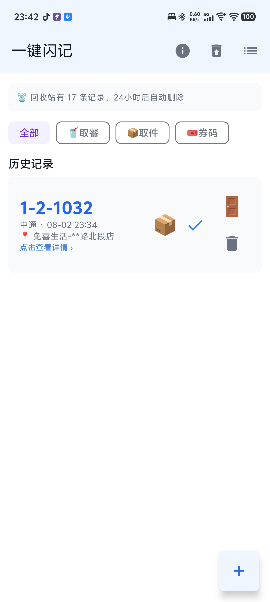
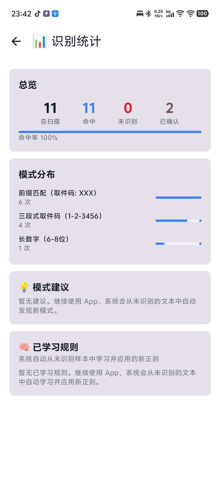
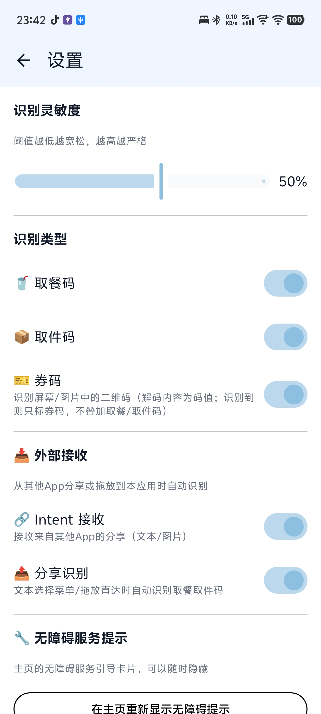

[中文](README.md) | [English](README.en.md)

# Pickup Code App

Automatically recognize pickup codes from screenshots or shared images, with notification reminders and one-tap status management.

<div align="center">
  
  
  
</div>

## Features

### Core Recognition
- **Multiple trigger methods**: Quick Settings tile, accessibility auto-scan, share menu
- **Intelligent OCR**: ML Kit Chinese-English mixed recognition with automatic Unicode dash normalization (including Japanese long vowel mark U+30FC)
- **Multi-format support**: 3-segment (1-2-3456), 4-segment (A1-2-3-45), letter-prefix 3-segment (A1-2-3456), letter-number (D-12345), long digits, prefixed codes, and more
- **Context-aware**: Distinguishes parcel delivery vs. food pickup scenarios, automatically filtering noise digits
- **AI-enhanced**: Optional integration with any OpenAI-compatible API (defaults to GPT-4o-mini, configurable), running in parallel with regex extraction with deduplicated results
- **Coupon (QR code) recognition**: Detects **QR codes** on screen/images, decoding and storing their content

### Address Recognition
- **Multi-strategy pipeline**: 11-level cascade from explicit labels → "pick up at..." patterns → cabinet numbers → pipe-separated formats → fallback, with automatic cross-line stitching for OCR-split addresses
- **Collapsed address completion**: When delivery/pickup addresses are truncated by the UI, automatically replaces them with the full street address visible on the same screen
- **Kuaidi100 reverse verification**: Queries the Kuaidi100 API using detected tracking numbers to verify pickup codes/addresses against ground truth and fill in missing addresses

### Source Identification
- **Order number prefix matching**: JT→J&T, SF→SF Express, YT→YTO, etc., prioritized over OCR text
- **Structured localization**: Brand+suffix pattern recognition (X Courier/X Logistics), bracket brand detection + proximity matching
- **Food brand coverage**: 24+ brands including Luckin, Starbucks, Heytea, Mixue, CHAGEE, Linlee, and more

### Data Management
- **Smart deduplication**: One-tap cleanup of all duplicate records for the same code, no leftover entries after bulk deletion
- **Repeat notifications**: Push reminders when a previously seen code reappears, with quick navigation for organization
- **Trash**: Mark-as-picked codes retained for 24 hours with undo/restore support
- **Map verification**: Automatic geocoding validation of extracted addresses (AMap API optional)
- **Fully local**: Data stored only on device, never uploaded. AI/Map/Kuaidi100 network features are opt-in and require manual configuration.

### Self-Learning
- **Automatic pattern discovery**: Clusters unrecognized OCR text to automatically generate new regex rules
- **User feedback loop**: Confirm/mark-as-incorrect on the detail page, tracking accuracy for each pattern
- **Statistics panel**: Overview of hit rate, pattern distribution, learned rules, and candidate suggestions

## Quick Start

1. Download the APK and install
2. Enable the accessibility service (Settings → Accessibility → Pickup Code App)
3. Add the tile to Quick Settings (swipe down → ✏️ → find "Pickup Code App")
4. Method 1: Open a delivery/food app → tap the tile → auto-recognize
5. Method 2: Take a screenshot → Share menu → choose "Pickup Code App"
6. Method 3: Share an image from any app → Pickup Code App → auto-recognize (images only)

## Tech Stack

| Module | Technology |
|--------|------------|
| UI | Jetpack Compose + Material3 |
| OCR | ML Kit Text Recognition (Chinese) |
| Screenshot | AccessibilityService takeScreenshot |
| External Intake | Intent Filter (SEND / PROCESS_TEXT) |
| Trigger | Quick Settings Tile + Accessibility auto-scan |
| Storage | Room (SQLite) |
| Settings | DataStore Preferences |
| Maps | Android Geocoder + AMap API (optional) |
| Courier Verification | Kuaidi100 API (optional) |
| AI | Optional OpenAI-compatible API (defaults to GPT-4o-mini, configurable endpoint and key) |
| Self-Learning | Local clustering + automatic regex generation |

## Project Structure

```
app/src/main/java/com/pickupcode/app/
├── App.kt                  # Application: global scope, notification channels
├── MainActivity.kt         # Home/history/trash/manual entry + navigation
├── data/                   # Data layer: Room entities + DAO (dedup/trash/archive)
│   ├── CodeHistory.kt
│   └── CodeHistoryDao.kt
├── extractor/              # Recognition core
│   ├── CodeExtractor.kt    # Pickup/food code regex + scoring + S0-S10 address pipeline
│   ├── AddressExtractor.kt # Structured address extraction (station/cabinet/location)
│   ├── BrandResolver.kt    # Brand identification (courier/food chain)
│   ├── CodeValidator.kt    # Code format validation + exclusion rules
│   ├── AIExtractor.kt      # OpenAI-compatible AI extraction
│   └── CouponDetector.kt   # QR code detection + decoding
├── ocr/OCREngine.kt        # ML Kit text recognition
├── learner/PatternLearner.kt  # Self-learning: automatic regex generation + stats
├── geocoder/GeocoderVerifier.kt   # Address geocoding verification
├── kuaidi100/Kuaidi100Verifier.kt # Kuaidi100 tracking number reverse lookup
├── notification/           # Pickup/food/coupon notifications + action broadcast receivers
├── preferences/AppPreferences.kt  # DataStore settings
├── service/                # Accessibility service (screenshot + recognition), Quick Settings tile
├── share/ShareReceiver.kt  # External share/drag-and-drop receiver
└── ui/                     # Compose UI: theme/components/screens
```

**Recognition pipeline**: `Screenshot/Share → OCR (text) + QR detection + Regex/AI (pickup/food codes) → Merge & deduplicate → Persist + Notify → Address verification / Kuaidi100 reverse lookup`

## Pickup Code Format Coverage

| Format | Example |
|--------|---------|
| 3-segment | `1-2-3456` |
| 4-segment | `A1-2-3-45` |
| Letter-prefix 3-segment | `A1-2-3456` |
| Letter-dash-number | `D-12345` |
| Letter+number (no dash) | `D12345` |
| Long number (6-8 digits) | `123456` |
| Prefixed | `Pickup code: 123456` |
| Food order | `A12` `123` |

## Developers

Want to build from source, contribute, or report an issue? See:

- **[Build Guide](docs/BUILDING.md)** — Build from source (JDK 17 / Gradle 8.9 / Android SDK requirements, FAQ)
- **[Contributing Guide](CONTRIBUTING.md)** — How to file issues, submit PRs, and coding conventions

## License

[GPL-3.0](LICENSE)
