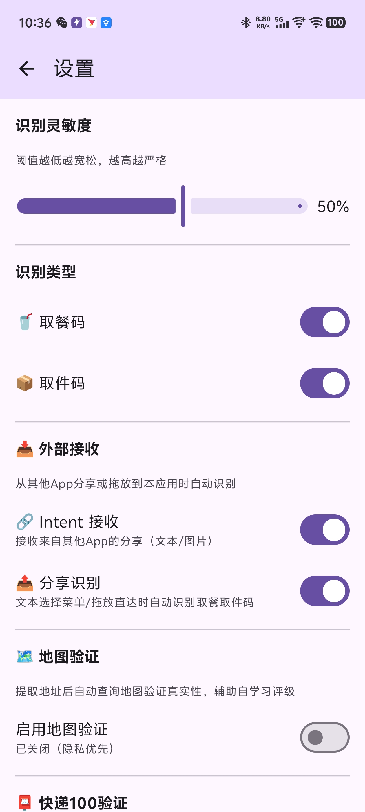
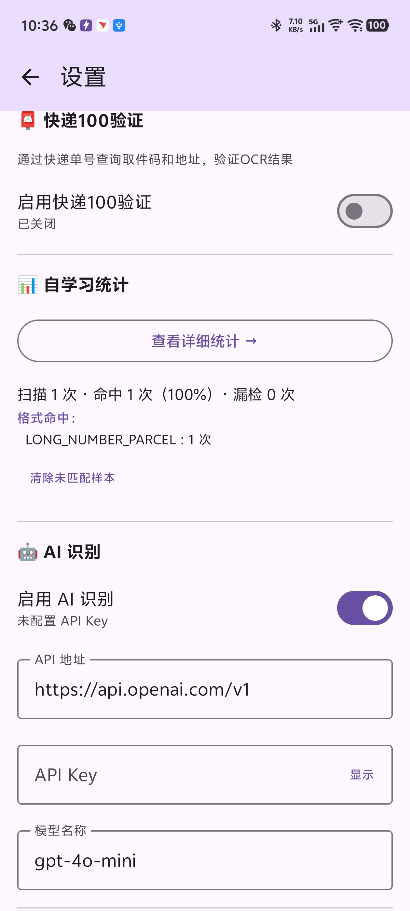
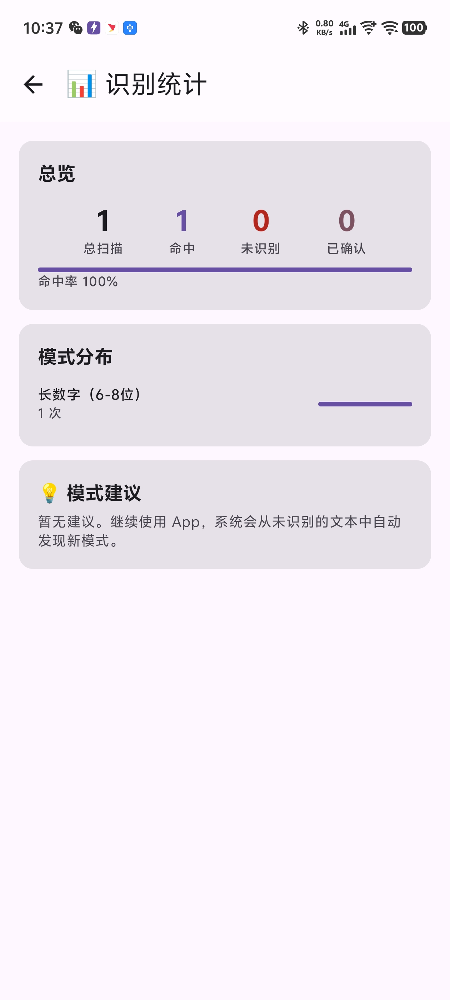
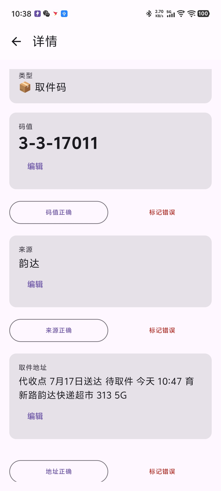
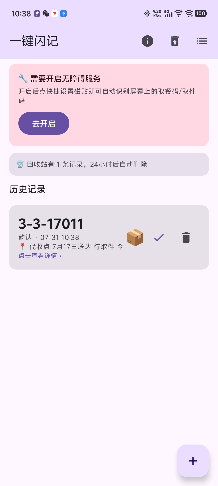

# 一键闪记

自动识别截屏 / 分享图片中的取餐码和取件码，通知提醒 + 一键标记已取。

  
  
  
  
  

## 功能

### 核心识别
- **多种触发方式**：控制面板磁贴、分享菜单
- **智能 OCR**：ML Kit 中英文混合识别，自动归一化 Unicode 横杠变体
- **多格式覆盖**：三段式 (1-2-3456)、四段式 (A1-2-3-45)、字母-数字 (D-06003)、长数字、带前缀的取件码等
- **上下文感知**：区分快递/餐饮场景，自动过滤干扰数字
- **AI 增强**：可选接入任意 OpenAI 兼容 API 提升准确率

### 来源识别
- **订单号前缀匹配**：JT→极兔、SF→顺丰、YT→圆通 等，优先于 OCR 文本
- **结构化定位**：品牌+快递/速递/物流后缀识别 + 【】括号品牌 + 邻近行匹配
- **餐饮品牌覆盖**：瑞幸、星巴克、喜茶、蜜雪冰城、霸王茶姬、林里 等 24 个品牌

### 数据管理
- **智能去重**：同码删除时一键清理所有重复记录，不残留
- **重复通知**：码值再次出现时推送提醒，可跳转整理
- **回收站**：标记已取后保留 24 小时，可撤销可恢复
- **地图验证**：提取地址后自动调用地理编码验证真实性（支持高德 API）
- **纯本地**：数据仅存储在本地，不上传

### 自学习
- **自动模式发现**：从未识别的 OCR 文本中聚类分析，自动生成新正则并应用
- **用户反馈闭环**：详情页确认/标记错误，记录每个模式的准确率
- **统计面板**：总览命中率、模式分布、已学习规则、候选建议

## 快速开始

1. 下载 APK 安装
2. 开启无障碍服务（设置 → 无障碍 → 一键闪记）
3. 把磁贴加到控制面板（下拉 → ✏️ → 找到「一键闪记」）
4. 方式一：打开外卖/快递 App → 点磁贴 → 自动识别
5. 方式二：截图 → 分享菜单 → 选择「一键闪记」
6. 方式三：分享图片 → 一键闪记 → 自动识别（仅支持分享图片）

## 技术栈

| 模块 | 技术 |
|------|------|
| UI | Jetpack Compose + Material3 |
| OCR | ML Kit Text Recognition (Chinese) |
| 截屏 | 无障碍服务 takeScreenshot |
| 外部接收 | Intent Filter (SEND / PROCESS_TEXT) |
| 触发 | Quick Settings Tile |
| 存储 | Room (SQLite) |
| 设置 | DataStore Preferences |
| 地图 | Android Geocoder + 高德 API |
| AI | 可选接入任意 OpenAI 兼容 API |
| 自学习 | 本地聚类分析 + 自动正则生成 |

## 取件码格式覆盖

| 格式 | 示例 | 场景 |
|------|------|------|
| 三段式 | `1-5-4044` | 丰巢、菜鸟 |
| 四段式 | `A1-2-3-45` | 京东快递柜 |
| 字母-横杠-数字 | `D-06003` | 韵达、邮政 |
| 字母+数字 (无横杠) | `D06003` | 韵达、邮政 |
| 长数字 (6-8位) | `609209` | 各快递通用 |
| 带前缀 | `取件码：609209` | 短信/通知 |
| 餐饮 | `A12` `918` | 瑞幸、古茗 等 |

## 版本历史

| 版本 | 主要更新 |
|------|---------|
| v1.0.0 | 首个版本，ML Kit OCR + 磁贴触发 |
| v1.0.1 | 林里取餐码支持、排除规则优化 |
| v1.0.2 | 截屏流程重构，删除无障碍服务 |
| v1.0.3 | 外部接收 (分享/拖放直达)，vivo原子岛适配 |
| v1.0.4 | OCR 横杠归一化、来源正则匹配、取件码格式扩展 |
| v1.0.5 | 地图验证、去重重写、自学习闭环 |

## 许可证

GPL-3.0
