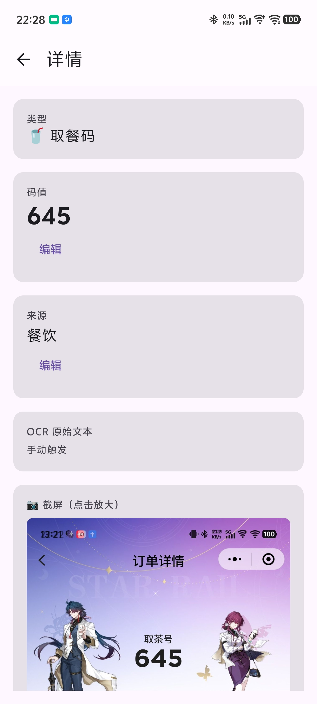
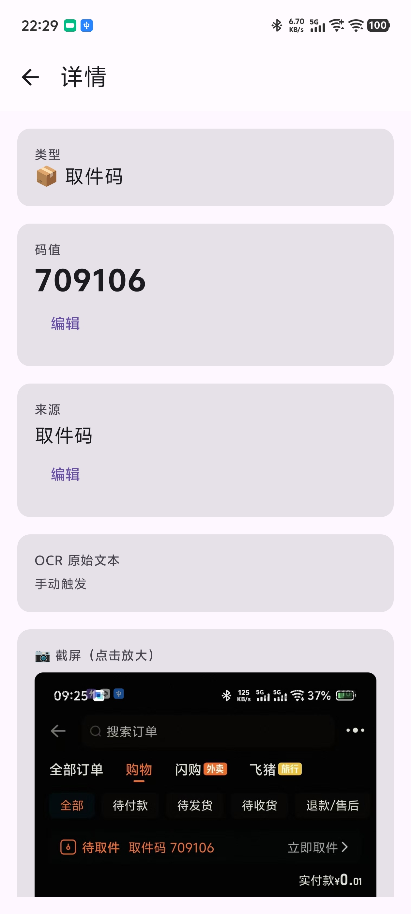

# 一键闪记

自动识别截屏中的取餐码/取件码，通知提醒 + 一键标记已取。

## 截图

  
  

## 功能

- **一键识别**：点控制面板磁贴，一键截屏识别取餐码/取件码
- **AI 识别**：可选接入 AI 提升准确率（支持自定义 API）
- **智能去重**：重复码值只保留最新，不刷屏
- **回收站**：标记已取后保留24小时，可撤销可恢复
- **通知快速标记**：通知栏直接点「已取」
- **纯本地**：数据不上传

## 快速开始

1. 下载 APK 安装
2. 开启无障碍服务（设置 → 无障碍 → 一键闪记）
3. 把磁贴加到控制面板（下拉 → ✏️ → 找到「一键闪记」）
4. 打开外卖/快递 App，点磁贴即可识别

## 技术栈

| 模块 | 技术 |
|------|------|
| UI | Jetpack Compose + Material3 |
| OCR | ML Kit Text Recognition |
| 截屏 | 无障碍服务 takeScreenshot |
| 触发 | Quick Settings Tile |
| 存储 | Room (SQLite) |
| AI | 可选接入任意 OpenAI 兼容 API |

## 许可证

GPL-3.0
